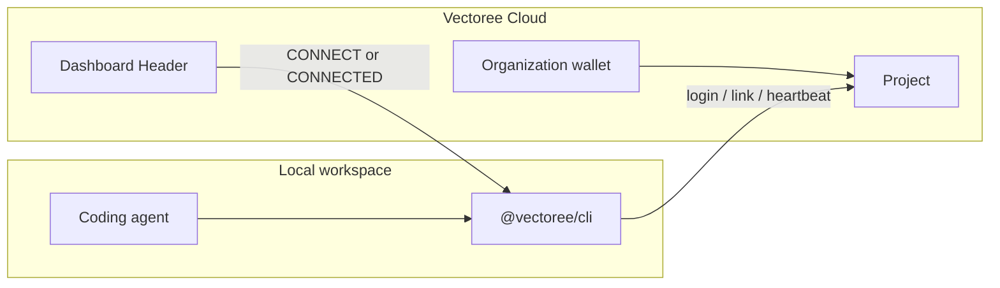

Vectoree connects a **Dashboard** (web) to your **local workspace** (CLI and coding agents such as Cursor, Claude Code, Trae, and Codex). The two sides talk through `@vectoree/cli` commands and a heartbeat probe. This page is the operator guide for that connection: first link, multi-project and multi-org workflows, Header status, troubleshooting, and a CLI cheat sheet.



| Concept | What it is | What it is not |
| --- | --- | --- |
| **Account** | The person signing in | A billing wallet |
| **Organization** | The billing and credit container | A git repo |
| **Project** | One app / one local directory binding | An organization |

A local directory can bind to **one** Cloud project at a time via `npx @vectoree/cli link`. The first project in a new org is named `default`. Later projects must use a custom, unique name.

<Tip>
  The first time an account successfully connects any project, Vectoree credits **$5.00** to that account's **Default Org**. The grant is hardware-backed: once per account and once per device. Team members who later join the same org do not receive another grant.
</Tip>

---

## Quickstart: connect a local repo

### Prerequisites

Before you link:

1. **Node.js 18+** with `npx` on your `PATH` (Node 20 LTS recommended).
2. A **Vectoree account**. Sign in at [vectoree.ai/dashboard/login](https://vectoree.ai/dashboard/login) with Google or email. Vectoree creates a Default Org and a `default` project on first sign-in.
3. The app repo you want to bind — run CLI commands from that directory, not from a parent folder or a random clone.

<Info>
  Cloud login (`npx @vectoree/cli login`) is for **you**. Adding login to *your app's users* is a different product — see [Authentication](/auth).
</Info>

### Three-step connect

You can paste the Dashboard Prompt into a coding agent, or run the same three commands yourself. Both paths write a scoped project key under `.vectoree/` and start the heartbeat.

**Agent path (recommended):** in the Dashboard, click the Header button **CONNECT** (yellow) or **CONNECTED** (green). Copy the project Prompt from the modal and paste it into Cursor, Claude Code, Trae, or Codex:

```text
Set up Vectoree as the backend for this project.
The Vectoree skill is installed. Follow it.
1. npx @vectoree/cli login
2. npx @vectoree/cli link
3. npx @vectoree/cli ai status
```

If the agent cannot load installed skills, point it at the canonical skill instead:

```text
Set up Vectoree as the backend for this project.
Follow the skill at:
https://raw.githubusercontent.com/VectoreeAI/vectoree-skills/main/skills/vectoree/SKILL.md

1. npx @vectoree/cli login
2. npx @vectoree/cli link
3. npx @vectoree/cli ai status
```

**CLI path:** run the three steps below from your app repo.

<Steps>
  <Step title="Install the Skill toolkit">
    This copies the Vectoree playbooks into the agent skill directory (project-local by default: `./.agents/skills/vectoree`). Add `-g` for a global install.

    ```bash
    npx skills add VectoreeAI/vectoree-skills
    ```

    Skill source: [VectoreeAI/vectoree-skills](https://github.com/VectoreeAI/vectoree-skills).
  </Step>

  <Step title="Log in and bind this directory">
    ```bash
    npx @vectoree/cli login
    npx @vectoree/cli link
    ```

    `login` opens a browser (PKCE) and stores a Cloud session for your account. `link` asks you to pick an existing project or create one, then writes a scoped API key to `.vectoree/config.json`.

    Add `.vectoree/` (and `.env` if you copy the key there) to `.gitignore`. Never commit real keys.

    Headless / CI: set `VECTOREE_API_KEY` and skip browser login. See [CLI reference](#cli-reference). Device-code login is `npx @vectoree/cli login --use-device-code` — use it only when you cannot set an API key and have no loopback browser.
  </Step>

  <Step title="Verify connectivity">
    ```bash
    npx @vectoree/cli whoami
    npx @vectoree/cli current
    npx @vectoree/cli ai status
    ```

    You are connected when:

    - `whoami` prints your account
    - `current` prints the linked project name and `projectId`
    - `ai status` returns the API origin and a masked key
    - Dashboard Header (top-right) shows **CONNECTED** (green) on **that same project**, with a recent heartbeat such as `2s ago`

    If the Header still shows **CONNECT** (yellow), you are looking at a different project in the Dashboard, or the heartbeat is not reaching Cloud. Jump to [Troubleshooting](#troubleshooting).
  </Step>
</Steps>

### Team members connecting to an existing project

Invitees do **not** create a second project. They join the org, open the same project in the Dashboard, copy the **same** project Prompt, and run `login` → `link` in their own clone.

| What they see | What happens |
| --- | --- |
| CLI / agent: link succeeded | Their directory binds to the existing project. A project key is written locally. Heartbeat starts. |
| Dashboard: **CONNECTED** | Header on that project turns green once Cloud receives their heartbeat. |
| Wallet: no extra $5.00 | The welcome credit is granted once, when the first account on the device successfully connected. Later members of the same org do not receive another grant. |

<Warning>
  The $5.00 welcome credit is an **account + device** grant into the creator's **Default Org**, not a per-project or per-member bonus. Connecting a second laptop, a second account, or a Team Org you already joined will not pay out again.
</Warning>

---

## Multi-project and multi-org workflows

### Create and switch projects

The first project in an org is named `default`. You cannot create another project named `default`, and project names must be unique inside the org.

**Create a new project** in the Dashboard (project switcher, top-left), or during `link` when the CLI offers to create one. Use a name that matches the app (`web-app`, `mobile-api`) — not `default`.

**See what this directory is bound to:**

```bash
npx @vectoree/cli current
```

**Switch this directory to a different Cloud project** (re-link). A directory maps to one project; the new `link` replaces the previous binding:

```bash
npx @vectoree/cli unlink
npx @vectoree/cli link
```

Pick the target project when prompted. Then confirm:

```bash
npx @vectoree/cli current
npx @vectoree/cli ai status
```

<Info>
  `unlink` removes the local binding only. `unlink --revoke` also revokes the Cloud API key. Use `--revoke` when the directory should no longer be allowed to call that project.
</Info>

After a successful re-link:

- The **newly selected** project's Header turns **CONNECTED** once heartbeat resumes.
- The **previous** project's Header falls back to **CONNECT** and **OFFLINE** after Cloud goes 30 seconds without a heartbeat from this machine.

### Multiple organizations and Team Org billing

Billing lives on the **organization**, not on the account and not on the project.

| Wallet | When it is used |
| --- | --- |
| **Default Org** | Personal work on projects that belong to your Default Org. This is where the $5.00 welcome credit lands. |
| **Team Org** | Work on a project that belongs to that team. Model Gateway and Tool Hub usage debit the **team** wallet. |

Consequences:

- Joining a Team Org does **not** move your Default Org balance with you.
- Usage on a team project does **not** spend your personal $5.00.
- If a team project returns an insufficient-balance error, the **Team Org** owner tops up under **Organization → Billing** — topping up your Default Org will not unstick that project.
- The $5.00 grant still fires at most once per account and device, even if you later create more orgs.

Check which org/project the CLI is using before you debug billing:

```bash
npx @vectoree/cli whoami
npx @vectoree/cli current
npx @vectoree/cli ai status
```

Dashboard: confirm the org and project in the **top-left switcher**, then open **Organization → Billing**.

### Re-linking / overwriting a local binding

Use re-link when the folder should point at a different Cloud project (new app, wrong project picked on first `link`, or moving from `default` to a named project).

1. From the repo root, note the current binding:

   ```bash
   npx @vectoree/cli current
   ```

2. Drop the local binding (add `--revoke` if the old key should die):

   ```bash
   npx @vectoree/cli unlink
   ```

3. Bind again and select the other project (do not create a duplicate `default`):

   ```bash
   npx @vectoree/cli link
   ```

4. In the Dashboard, switch the top-left project selector to the **same** `projectId`. The Header should move from **CONNECT** to **CONNECTED** after the next successful heartbeat.

<Warning>
  `link` overwrites `.vectoree/config.json` for this directory. It does not merge two projects. If two clones need two projects, keep them in two directories.
</Warning>

---

## Status and heartbeat

The Dashboard Header (top-right) is the live probe. It is always visible. Click it at any time to reopen the Prompt modal.

### Header states

| Header | Color | Meaning |
| --- | --- | --- |
| **CONNECTED** | Green | Cloud is receiving heartbeats from a CLI / agent bound to **this** project. The control shows the last heartbeat, for example `2s ago`. |
| **CONNECT** | Yellow | No active session for this project: not linked, linked to a different project, or the agent is stopped. |
| **CONNECT** + **OFFLINE** | Yellow, with an offline hint (treated as red / failed in troubleshooting) | This project *was* connected, but Cloud has not received a heartbeat for **more than 30 seconds**. |

Heartbeat is an outbound probe from the local CLI to Vectoree Cloud. Cloud does not dial into your laptop. If the process exits, sleeps, or the probe is blocked, the Header degrades automatically — you do not need to log out.

### Automatic recovery and polling

The Dashboard polls for heartbeats. You do not re-run `link` just to turn the light green.

Typical recoveries:

| You do this locally | Dashboard does this |
| --- | --- |
| Restart the coding agent or resume the CLI in the linked repo | Heartbeats resume. Header returns to **CONNECTED** on the matching project. |
| Run `npx @vectoree/cli ai status` | Confirms the key and origin, and is enough to refresh a stale probe. Header flips green on the next poll. |
| Click **CONNECT** in the Header | Forces a probe cycle without waiting for the next idle poll. Useful across tabs. |

If the Header stays yellow after a successful `ai status`, the Dashboard is almost always showing a **different project** than `npx @vectoree/cli current`. Match the top-left project selector to that `projectId`.

---

## Troubleshooting

Each case below is a symptom → cause → one-shot fix. Run commands from the linked repo.

<AccordionGroup>
  <Accordion title="A — Unauthorized, or the token looks expired">
    **Symptom.** CLI prints `Unauthorized`, `401`, or `403`. `login` / `link` / `ai status` fail. Dashboard may still look signed in.

    **Cause.** The machine has a stale Cloud session (old account, expired token, or a leftover login from another identity).

    **Fix.** Force a new login, then confirm identity and binding:

    ```bash
    npx @vectoree/cli login --force
    npx @vectoree/cli whoami
    npx @vectoree/cli current
    npx @vectoree/cli ai status
    ```

    If `current` is empty after re-auth, run `npx @vectoree/cli link` again. For a key that was revoked in the Dashboard, `unlink` then `link` so a new scoped key is issued.

    Headless environments should rotate `VECTOREE_API_KEY` rather than using `--force`.
  </Accordion>

  <Accordion title="B — Dashboard shows CONNECT (yellow) while the CLI says success">
    **Symptom.** `link` and `ai status` succeed locally. Header stays **CONNECT** or **OFFLINE**.

    **Cause (most common).** The directory is bound to **Project A**, but the Dashboard top-left switcher is on **Project B**. Heartbeats are arriving — just not for the project you are looking at.

    **Cause (network).** Outbound heartbeat to `https://vectoree.ai` is blocked by a corporate proxy, VPN, or firewall. CLI commands that already ran may have succeeded earlier; live probes then fail.

    **Fix.**

    1. Print the local binding:

       ```bash
       npx @vectoree/cli current
       ```

    2. In the Dashboard, set the top-left project selector to that same `projectId` / name.
    3. Click **CONNECT** to force a probe, or run:

       ```bash
       npx @vectoree/cli ai status
       ```

    4. If the project matches and the Header is still yellow, allow HTTPS to `https://vectoree.ai` (staging: `https://vectoree.net`) and retry from a network that does not intercept TLS.

    Staging origin:

    ```bash
    export VECTOREE_API_URL=https://vectoree.net
    npx @vectoree/cli ai status
    ```
  </Accordion>

  <Accordion title="C — Connected, but no $5.00 welcome credit">
    **What this means.** `🟢 Project Successfully Connected!` means the workspace is bound. The $5.00 credit is a separate first-time org grant. When it is not issued, one of these usually applies:

    1. **Not the org Owner (team member connecting).** Welcome credit is org-level. Members connecting to a shared project use the existing shared balance — a second personal grant is not issued.
    2. **Organization already funded (Org Funded).** The $5.00 credit is for unpaid, first-time orgs. A prior top-up or card-on-file marks the org as paid, so the free grant does not apply.
    3. **Device or account grant limit (Device/Account Limit).** The credit is once per real device (MAC/IP) and once per account lifetime. A later connect still binds the workspace; the payout is skipped silently.
    4. **Email not verified (Email Unverified).** Unverified or disposable emails hold the grant. Verify (or bind a regular address in account settings) and the balance unlocks in real time.

    **What to do.** The connection is already in place.

    1. Open **Organization → Billing** for the org that owns the project.
    2. If you are a Member, confirm with the Owner whether the shared org wallet already has balance.
    3. If the email is unverified, complete verification and check Billing again.
    4. If paid models need more balance, top up that org under [Billing](/billing) — that is independent of the welcome grant.
  </Accordion>

  <Accordion title="D — Status is stale across tabs or devices">
    **Symptom.** One browser tab shows **CONNECTED**, another still shows **CONNECT**. A second laptop has not picked up the first machine's state yet.

    **Cause.** Header state is probe-driven per project, per viewer session. Tabs and devices do not share an instantaneous lockstep clock; they catch up on the next poll.

    **Fix.**

    1. Refresh the stale tab.
    2. Click **CONNECT** / **CONNECTED** in the Header to force a probe.
    3. On the machine that should be live, from the linked repo:

       ```bash
       npx @vectoree/cli ai status
       ```

    A laptop that is not running the CLI will correctly show **OFFLINE** after 30 seconds. That is the heartbeat, not a sync bug.
  </Accordion>
</AccordionGroup>

### Quick isolation checklist

Run these before opening a support thread:

```bash
npx @vectoree/cli whoami
npx @vectoree/cli current
npx @vectoree/cli ai status
```

| Check | Healthy result |
| --- | --- |
| `whoami` | The account you expect (not a leftover identity) |
| `current` | Project name + `projectId` matching the Dashboard switcher |
| `ai status` | Origin `https://vectoree.ai` (or your staging origin) and a masked key |
| Header | **CONNECTED** on that same project, heartbeat newer than 30s |
| Wallet | Org that **owns the project** has balance, if you are calling paid models |

---

## CLI reference

Prefer `npx @vectoree/cli` so the agent uses a current package. Global flags on every command: `--json`, `--yes`, `--api-url <url>`.

### Connection and identity

| Command | What it does | Example |
| --- | --- | --- |
| `login` | Sign in to Vectoree Cloud (browser PKCE) | `npx @vectoree/cli login` |
| `login --force` | Discard a stale session and re-authenticate | `npx @vectoree/cli login --force` |
| `login --use-device-code` | Headless login when you cannot use loopback + API key | `npx @vectoree/cli login --use-device-code` |
| `logout` | Clear the local Cloud session | `npx @vectoree/cli logout` |
| `whoami` | Print the signed-in account | `npx @vectoree/cli whoami` |
| `link` | Bind this directory to one Cloud project; write `.vectoree/config.json` | `npx @vectoree/cli link` |
| `unlink` | Remove the local binding | `npx @vectoree/cli unlink` |
| `unlink --revoke` | Unbind and revoke the Cloud key | `npx @vectoree/cli unlink --revoke` |
| `current` | Show the linked project name and `projectId` | `npx @vectoree/cli current` |
| `keys list` | List project API keys | `npx @vectoree/cli keys list` |
| `ai status` | Probe gateway connectivity, origin, masked key, and wallet | `npx @vectoree/cli ai status` |

### CI / no browser

```bash
export VECTOREE_API_URL=https://vectoree.ai
export VECTOREE_API_KEY=sk-ve-v1-your_key_here
npx @vectoree/cli ai status
```

`VECTOREE_API_URL` is the **origin** (no trailing `/api`). Production default is `https://vectoree.ai`. Staging: `https://vectoree.net`.

### Also useful after you are linked

```bash
npx @vectoree/cli ai models list
npx @vectoree/cli db list
npx @vectoree/cli storage buckets list
npx @vectoree/cli --help
```

Full product commands live on [CLI setup](/quickstart), [Model Gateway](/models), [Database](/database), and [Storage](/storage). npm: [@vectoree/cli](https://www.npmjs.com/package/@vectoree/cli).

---

Still need help? Join our [Discord community](https://discord.gg/SgbKCtqEgT).
